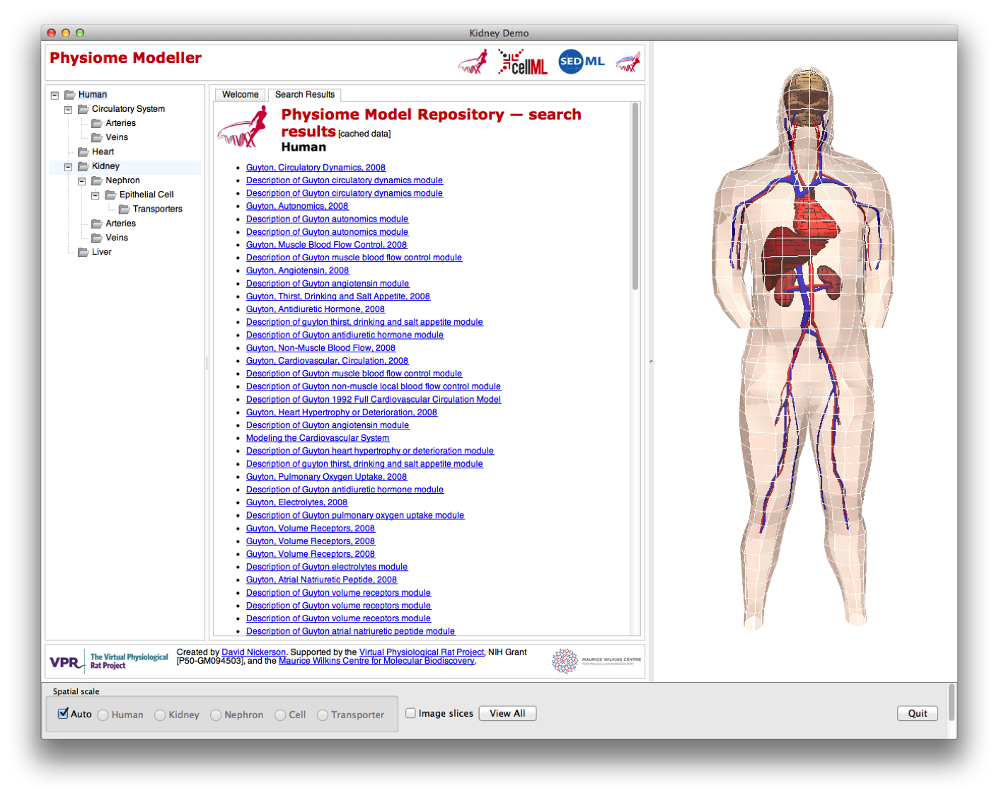
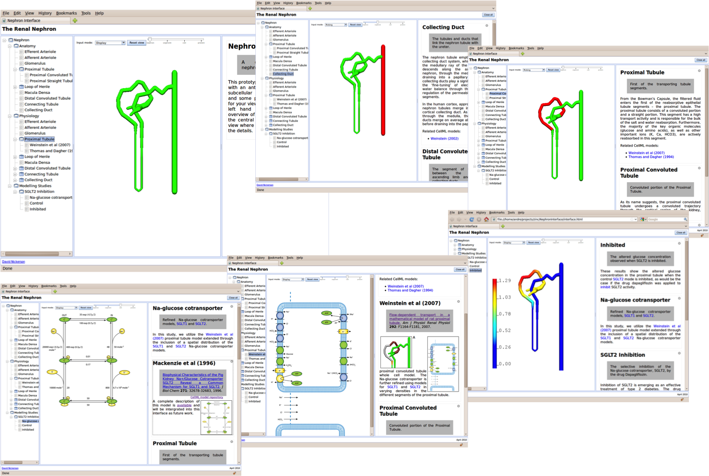
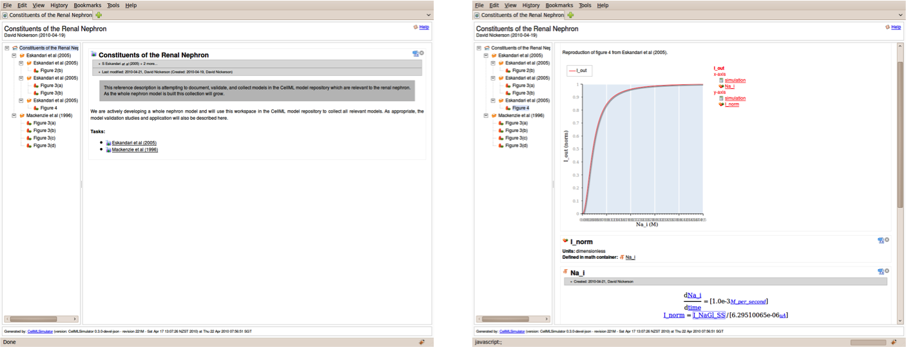
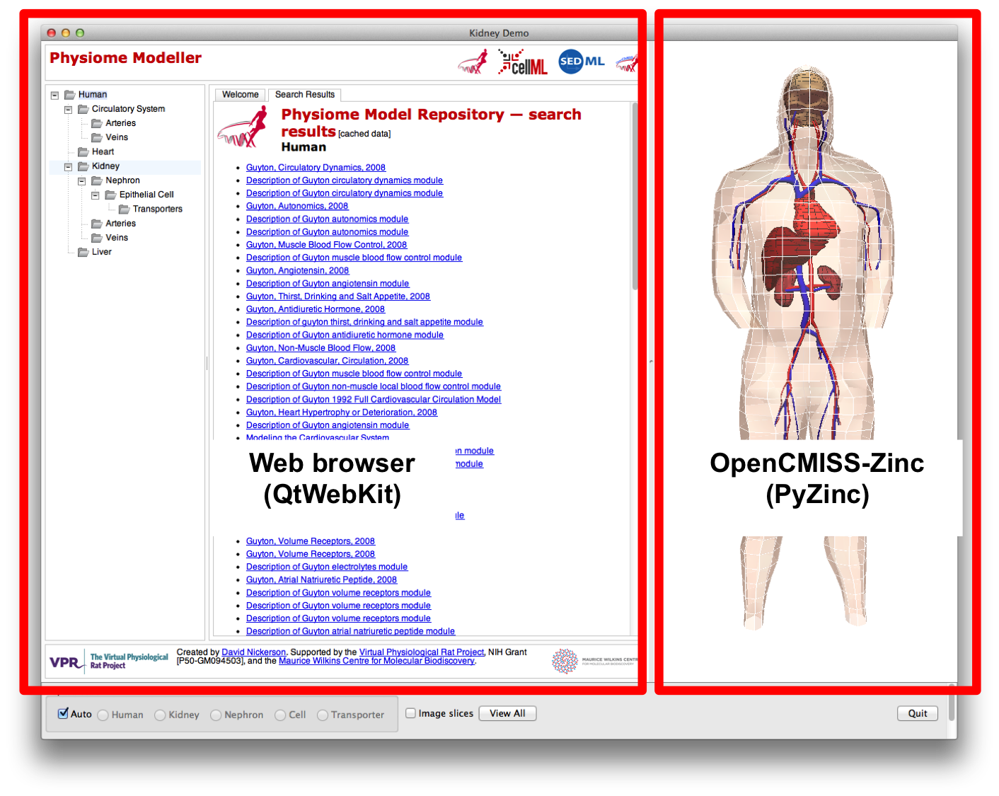
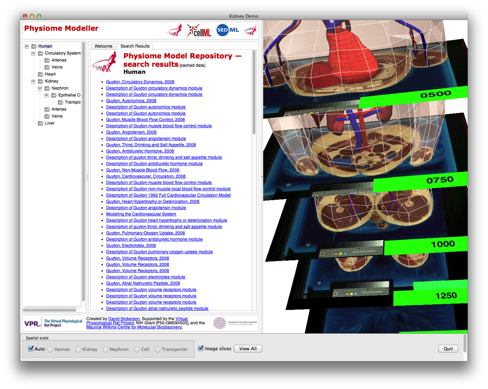
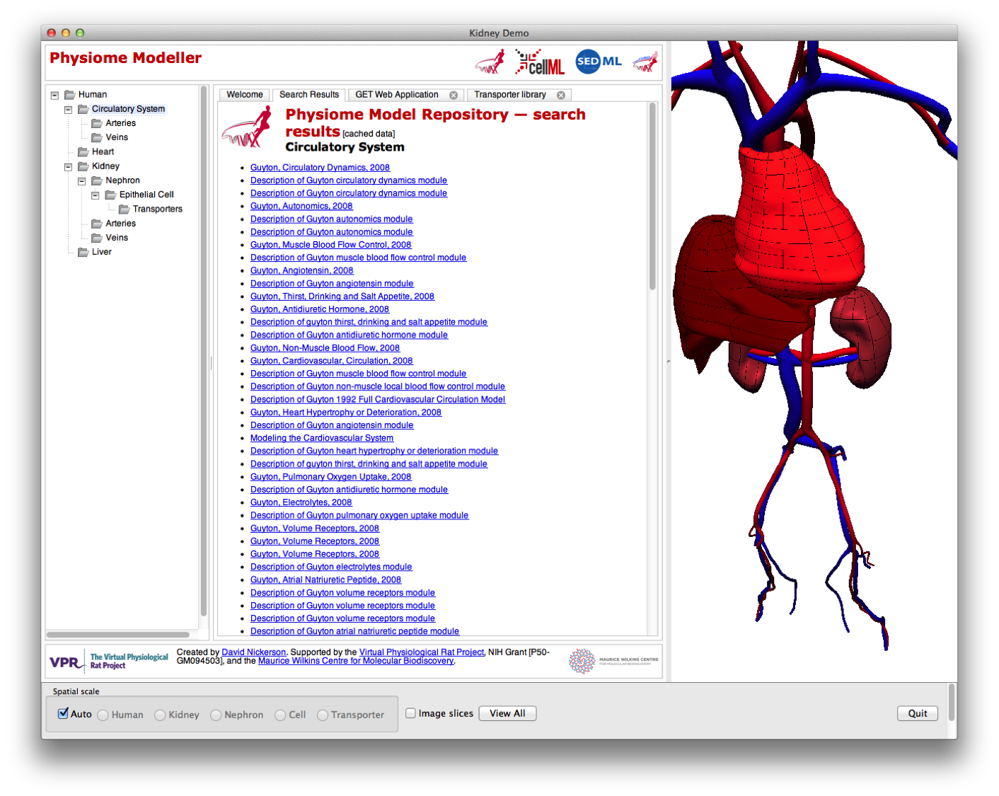
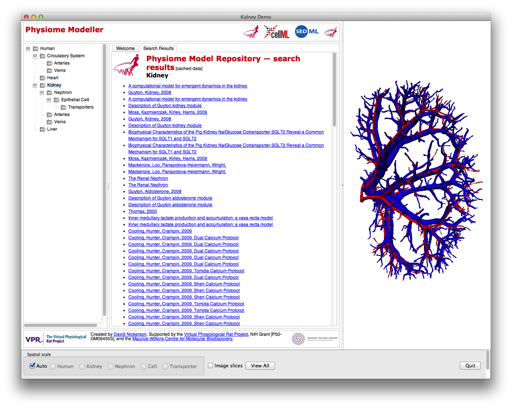
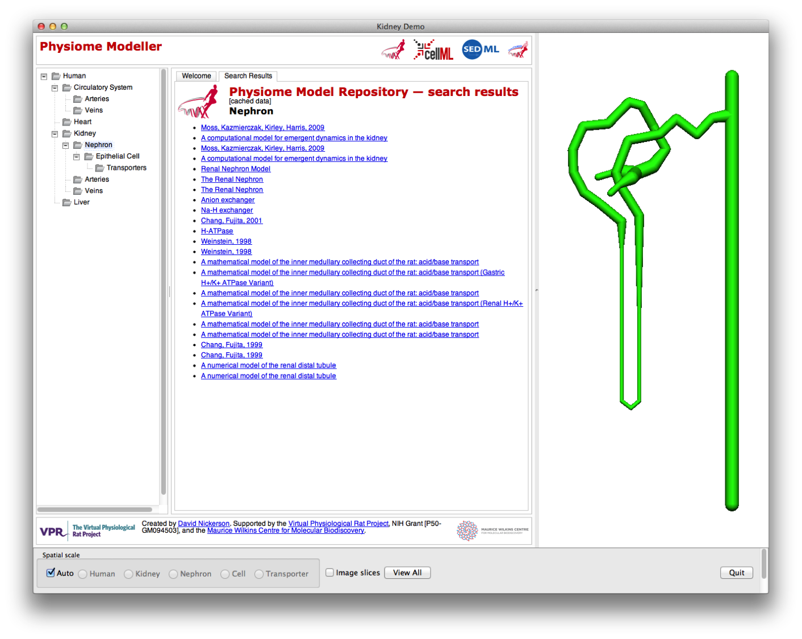
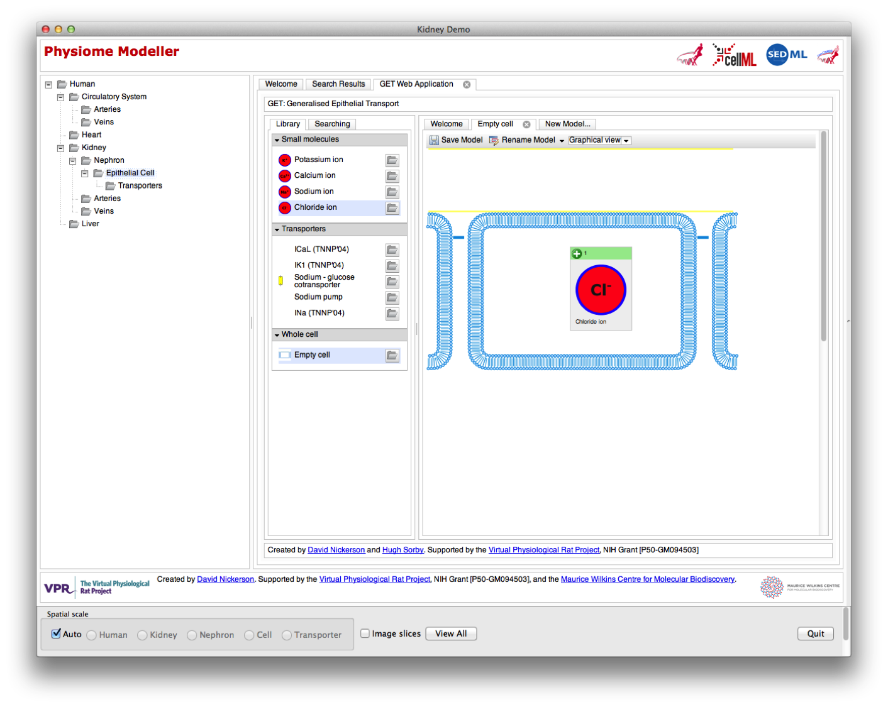
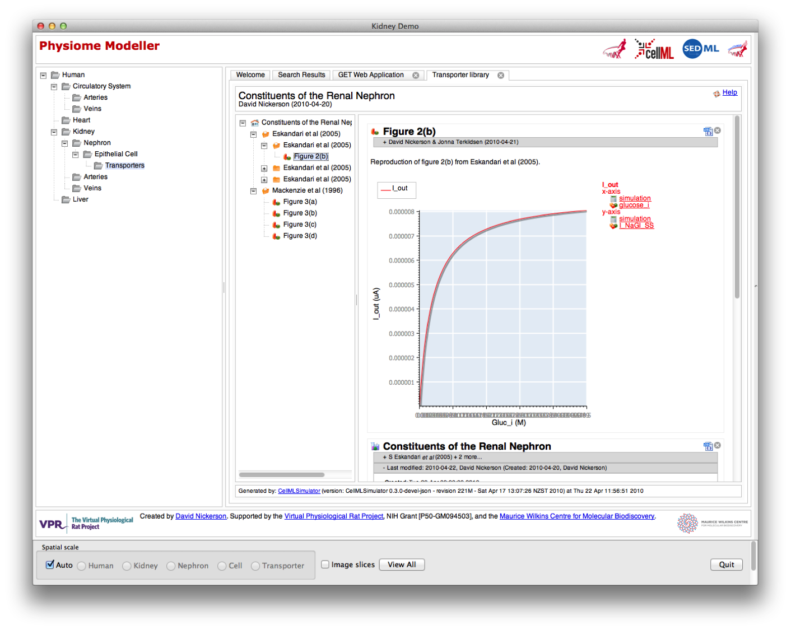

.. _physiome-modeller:

=================
Physiome Modeller
=================

`Physiome Modeller <https://bitbucket.org/physiome-modeller>`_ was developed initially as a prototype to demonstrate the interaction between a web-application and `OpenCMISS-Zinc`_ in the presentation and interaction with a multiscale, physiome-style, computational model. The primary focus of the demonstration was on the kidney, and hence the tool currently provides the greatest level of detail for the kidney, nephron, and renal epithelial cells.

A further aim for the Physiome Modeller was to integrate our previous work on a renal nephron browser (`doi: 10.1098/rsfs.2010.0032 <http://dx.doi.org/10.1098/rsfs.2010.0032>`_, shown below) and reference descriptions of `CellML`_ models (`doi: doi: 10.1109/IEMBS.2008.4649689 <http://dx.doi.org/10.1109/IEMBS.2008.4649689>`_ and `doi: 10.1093/bioinformatics/btn080 <http://dx.doi.org/10.1093/bioinformatics/btn080>`_, shown below) with the tools being developed under as part of the :ref:`GET framework <getIntroduction>`, in particular the :ref:`GET web application <getWebApp>`. While a purely web-based solution is desireable, the particular technology currently (and used in the nephron browser) used for the interactive three-dimensional visualisation (`OpenCMISS-Zinc`_) is not readily available for *easy* use across the main operating systems and web browsers.

The nephron browser interface.

The interactive reference description for CellML models.

So while the Physiome Modeller is a `Python <http://python.org>`_ desktop application, it is conceptually just a wrapper around a web browser which provides the link to the `OpenCMISS-Zinc`_ scene viewer, as shown below. In this manner, we are able to develop the GET tools as standard Javascript web applications and then directly connect them to the three-dimensional graphics with the expectation that once Zinc is available natively in the web browser the python wrapper can be easily replaced with a native Javascript implementation.

   
Overview
--------

The three aspects of the Physiome Modeller user interface are:

* the tree view on the left, allowing the user to navigate through the spatial scales;
* the centre panel, which displays the actual content; and
* the right panel shows the interactive graphical rendering of the model – i.e., the same as the nephron graphic in the original nephron browser.

In the example shown below, you see the “human” spatial scale where you get the search results for all data in the `Physiome Repository`_ matching “circulatory system” in the content pane and a whole body to play with in the graphical view.

Since we are using our fully fledged visualisation toolkit, we have access to all sorts of useful functionality. In this screen shot we have displayed some of the original images used to create this computational model (in this case from the visible human data set).

and here showing that as the user *"zooms"* in to the model, the skin has disappeared to allow uninterrupted views of the components of the human circulatory system.

   
In the Physiome Modeller, the user is able to navigate through the spatial scales, for the renal system only, either “automatically” by zooming in on the appropriate region of the graphical display; or by selecting the desired scale in the tree view on the left panel. Here we have shifted to the kidney (organ spatial scale) and can now see all search results from the `Physiome Repository`_ related to the kidney (in the centre panel) and the graphical rendering shows the larger vessels of the renal vasculature.

   
Zooming in further, the user drops down to the sub-organ spatial scale and is presented with the nephron model (from the previous nephron browser) and accompanying nephron search results from the repository.

   
Further zooming now drops the user down to the cell spatial scale. In the demonstration shown below, the user is presented with a certain epithelial cell model in the graphical rendering pane, but that has been hidden in this screen shot to allow a better view of the GET web application now being embedded inside the Physiome Modeller user interface. While not actually integrated into one web application, it does at least present a common look and feel across the tools and show where things are heading. The user is also able to easily navigate back up to the higher spatial scales, so that once we get the simulation capabilities all hooked up you could imagine how a user could *"edit"* their cell model in this view and then run whole nephron or kidney simulations and quick access the simulation results all in one tool.

.. _embeddedGetWebApplication:

   
When available for the current model being displayed, it is also possible for the user to browse an embedded version of the CellML reference description (described above), as shown below. Again, the model visualisation panel has been hidden.

.. _OpenCMISS-Zinc: http://opencmiss.org/zinc
.. _Physiome Repository: http://models.physiomeproject.org
.. _CellML: http://cellml.org

